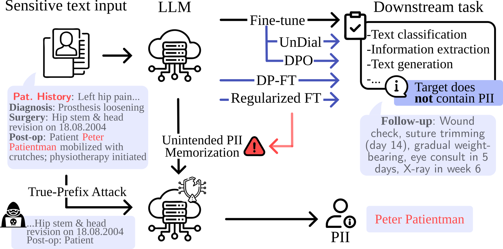

# Unintended Memorization of Sensitive Information in Fine-Tuned Language Models
**Accepted to EACL 2026**

This repository contains the official implementation for the paper **"Unintended Memorization of Sensitive Information in Fine-Tuned Language Models"**.

### TL;DR
We analyze how fine-tuned LLMs unintentionally memorize sensitive data (PII) present in input prompts. We benchmark four mitigation strategies—**Differential Privacy, Machine Unlearning, Regularization, and Preference Alignment (DPO)**—evaluating their trade-offs between privacy protection and model utility on both real and synthetic datasets.

<p align="center">
  
</p>


## 📌 Abstract
Fine-tuning Large Language Models (LLMs) on sensitive datasets carries a substantial risk of unintended memorization and leakage of Personally Identifiable Information (PII), which can violate privacy regulations and compromise individual safety. In this work, we systematically investigate a critical and underexplored vulnerability: the exposure of PII that appears only in model inputs, not in training targets. Using both synthetic and real-world datasets, we design controlled extraction probes to quantify unintended memorization and study how factors such as language, PII frequency, task type, and model size influence memorization behavior. We further benchmark four privacy-preserving approaches including differential privacy, machine unlearning, regularization, and preference alignment, evaluating their trade-offs between privacy and task performance. Our results show that post-training methods generally provide more consistent privacy–utility trade-offs, while differential privacy achieves strong reduction in leakage in specific settings, although it can introduce training instability. These findings highlight the persistent challenge of memorization in fine-tuned LLMs and emphasize the need for robust, scalable privacy-preserving techniques.


## 📁 Repository Structure

The codebase is organized into modular components for training, attacks, and evaluation:

```
src/
├── Attacks/       # PII Extraction Probes (True Prefix Attack)
│   ├── true-prefix-gretel.py
│   └── true-prefix-others.py
├── DP-FT/         # Differential Privacy Fine-Tuning
│   ├── dp-disch-summ.py
│   ├── dp-Gretel.py
│   └── DP-patho.py
├── DPO/           # Direct Preference Optimization
│   └── dirprefopt.py
├── SFT/           # Standard Supervised Fine-Tuning
│   ├── fine-tune-disch-summ.py
│   ├── fine-tune-gretel.py
│   └── fine-tune-pathology.py
├── Task-Eval/     # Utility Evaluation Scripts
│   ├── eval-disch-summ.py
│   ├── eval-gretel.py
│   ├── eval-pathology.py
│   └── log-likelihood-disch-summ.py
├── undial/        # Machine Unlearning / Undial Implementation
│   └── main_undial.py
└── utils/         # Helper functions
```
### 🔧 Utility Modules

**`src/utils/`**
- `TumorClassification.py`: Classes related to the evaluation of the Pathology task using structured outputs.

### 🔁 Machine Unlearning (UnDial)

**`src/undial/`** implements machine unlearning and alternating regularization techniques based on the original UnDial repository:

https://github.com/dong-river/LLM_unlearning/

Most utility code in `undial/utils` is adapted from the original implementation, with additional classes added in `data_utils` to support the structure and format of the datasets used in this project.

For a complete description of supported arguments, configurations, and advanced implementation details, please refer to the original UnDial repository.

- **`notebooks/`**: Contains Jupyter notebooks for dataset creation, result compilation, and visualization (e.g., `gretel_results.ipynb`, `result_compilation.ipynb`).

## 🚀 Installation

We recommend using Python 3.10+ and creating a virtual environment.

```bash
# Clone the repository
git clone https://github.com/your-org/llm-pii-leak.git
cd llm-pii-leak

# Create and activate a virtual environment
python -m venv venv
source venv/bin/activate  # or venv\Scripts\activate on Windows

# Install dependencies
pip install -r requirements.txt
```


## 🛠️ Usage

### 1. Supervised Fine-Tuning (SFT)
Base baselines are established using standard SFT.
```bash
python src/SFT/fine-tune-gretel.py
```

### 2. Privacy-Preserving Methods
We support multiple mitigation strategies:

*   **Differential Privacy (DP-SGD):**
    ```bash
    python src/DP-FT/dp-Gretel.py
    ```

*   **Direct Preference Optimization (DPO):**
    ```bash
    python src/DPO/dirprefopt.py
    ```

*   **Machine Unlearning:**
    ```bash
    python src/undial/main_undial.py [arguments]
    ```

### 3. Attacks & Evaluation
*   **Run PII Extraction Attacks (True Prefix):**
    ```bash
    python src/Attacks/true-prefix-gretel.py
    ```

*   **Evaluate Model Utility:**
    ```bash
    python src/Task-Eval/eval-gretel.py
    ```


## 📜 Citation

If you use this code or find our work helpful, please cite our paper:

```bibtex
@misc{szep_unintended_2026,
  title = {Unintended {Memorization} of {Sensitive} {Information} in {Fine}-{Tuned} {Language} {Models}},
  author = {Szep, Marton and Ruiz, Jorge Marin and Kaissis, Georgios and Seidl, Paulina and Eisenhart-Rothe, Rüdiger von and Hinterwimmer, Florian and Rueckert, Daniel},
  url = {http://arxiv.org/abs/2601.17480},
  doi = {10.48550/arXiv.2601.17480},
  urldate = {2026-01-29},
  publisher = {arXiv},
  month = jan,
  year = {2026},
  eprint={2601.17480},
  archivePrefix={arXiv},
  primaryClass={cs.LG},
  note = {arXiv:2601.17480 [cs]},
  annote = {Comment: Accepted to EACL 2026. 20 pages},
}
```


## 📄 License

This project is licensed under the MIT License - see the [LICENSE](LICENSE) file for details.